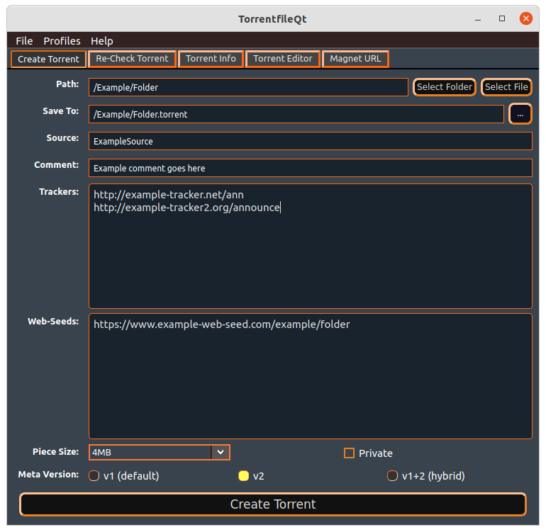
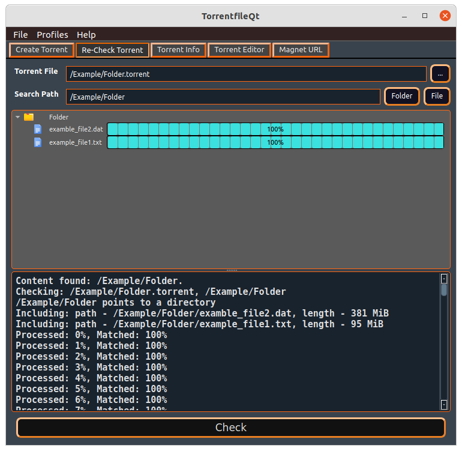
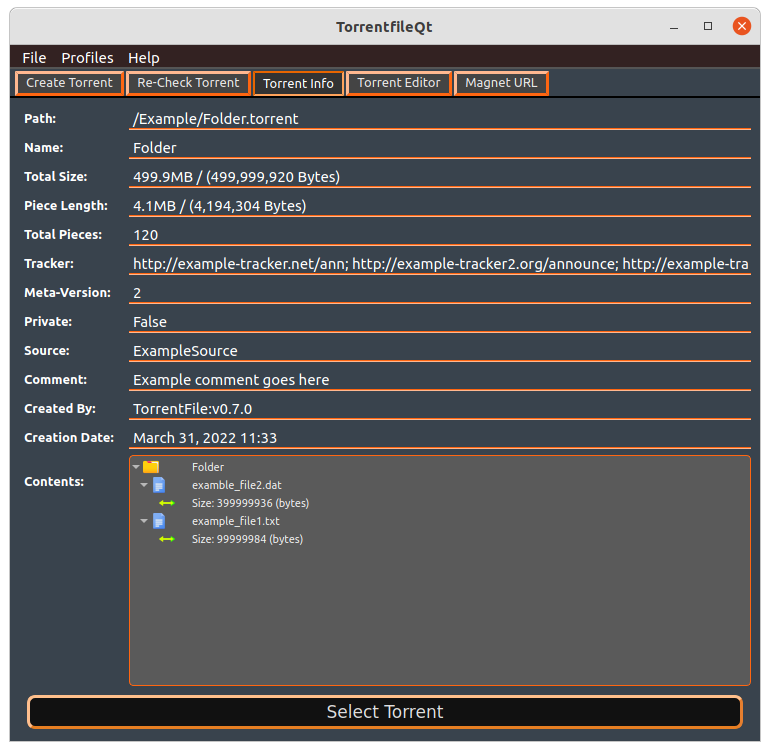

# TorrentFileQt


---------
[](https://www.codacy.com/gh/alexpdev/torrentfileQt/dashboard?utm_source=github.com&amp;utm_medium=referral&amp;utm_content=alexpdev/torrentfileQt&amp;utm_campaign=Badge_Grade)
[](https://codecov.io/gh/alexpdev/torrentfileQt)


[](https://www.codacy.com/gh/alexpdev/torrentfileQt/dashboard?utm_source=github.com&utm_medium=referral&utm_content=alexpdev/torrentfileQt&utm_campaign=Badge_Coverage)

TorrentFileQt is a GUI Frontend for [TorrentFile CLI](https://github.com/alexpdev/torrentfile) project.

## Features

- Create .torrent files
- Display detailed information for a .torrent file
- Bittorrent v1, v2 and hybrid .torrent files supported
- Check if a .torrent file contents are in filesystem
- Check progress or percentage complete for .torrent file
- Edit torrent files.

## Requirements

- Pyside6
- torrentfile

## ScreenShots



---------



---------


---------



---------

## Install

- From git:

```bash
git clone https://github.com/alexpdev/torrentfileQt.git
cd torrentfileQt
pip install -r requirements.txt
pip install .
torrentfileQt
```

- From PyPi

```bash
pip install torrentfileQt
torrentfileQt
```

> Alternatively you can download a precompiled binary from the release page.
