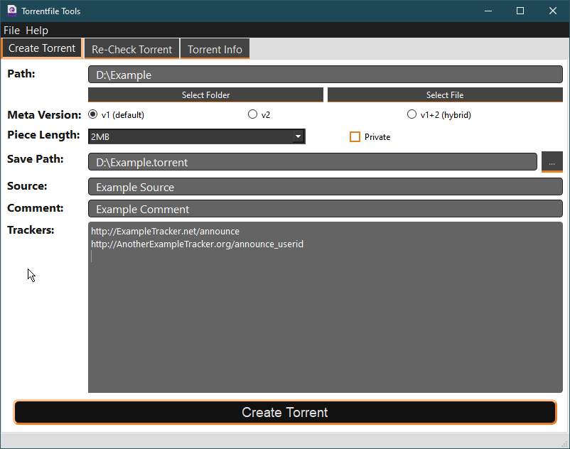
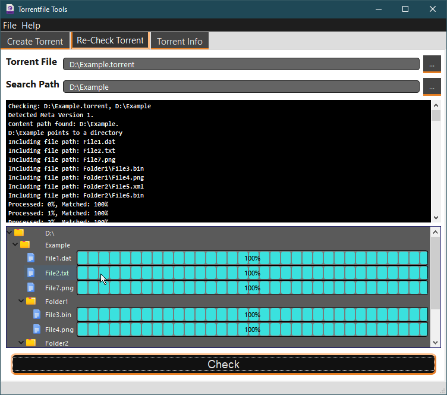
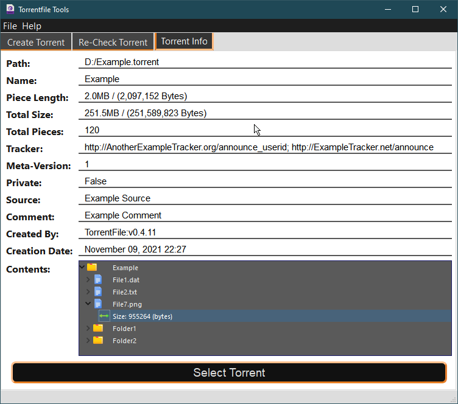
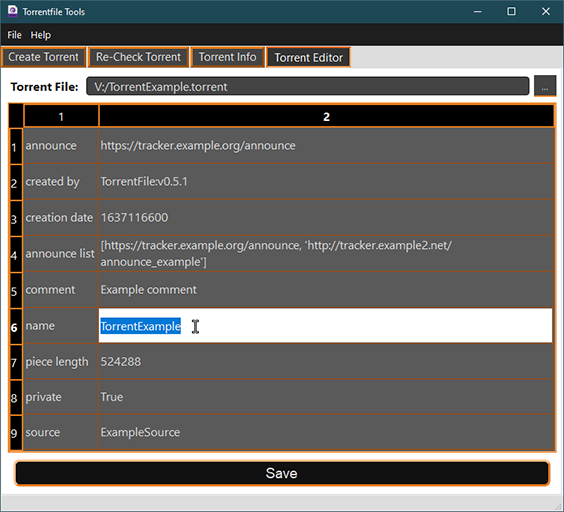

# TorrentFileQt

-------

TorrentFileQt is a GUI Frontend for [TorrentFile CLI](https://github.com/alexpdev/torrentfile) project.

## Features

- Create .torrent files
- Display detailed information for a .torrent file
- Bittorrent v1, v2 and hybrid .torrent files supported
- Check if a .torrent file contents are in filesystem
- Check progress or percentage complete for .torrent file
- Edit torrent files.

### Screenshots

-------

-------

-------

