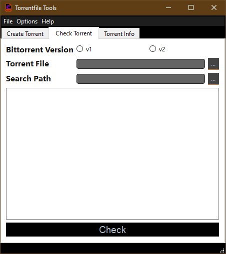
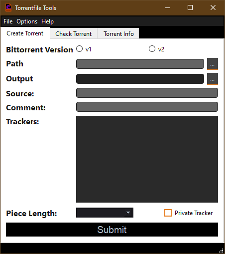
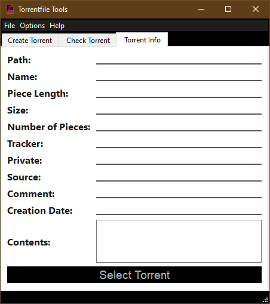

# Torrentfile-GUI

TorrentFileGUI is a Graphical User Interface for [TorrentFile CLI](https://github.com/alexpdev/torrentfile).

## Features

- Create .torrent files
- Display detailed information for a .torrent file
- Bittorrent v1, v2 and hybrid .torrent files supported
- Check if a .torrent file contents are in filesystem
- Check progress or percentage complete for .torrent file

### Screenshots

-------

-------

